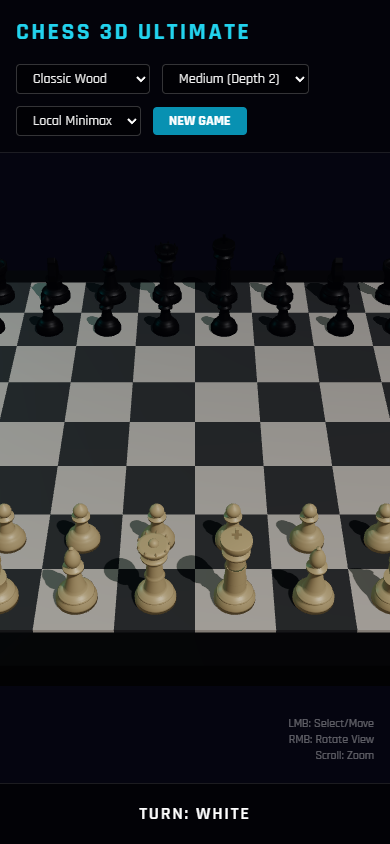

# Chess 3D Ultimate

## Rapport complet

Ce depot public presente le concept, les fonctions, les choix de conception, les outils utilises, les commandes locales et les captures d'ecran de l'application. Il est genere par l'orchestrateur uniquement apres validation de publication publique.

## Concept

Jeu d'echecs 3D dans le navigateur. Il combine plateau WebGL, pieces procedurales, regles chess.js, IA locale et option Gemini.

Creer un jeu d'echecs visuel, interactif et presentable.

Public vise: Jeu, demonstration 3D et experimentation WebGL.


## Fonctionnement de l'application

La partie est geree par chess.js: selection d'une piece, affichage des coups valides, execution du coup, mise a jour du FEN et tour de l'IA noire. La scene Three.js reconstruit le plateau, les pieces, les effets de selection et les animations. L'IA peut jouer en local avec evaluation/minimax ou utiliser Gemini, avec validation du coup repondu et fallback si la reponse n'est pas jouable.

## Fonctions de l'application

- Affiche un plateau d'echecs 3D interactif.
- Valide les coups et gere la partie avec chess.js.
- Joue les reponses IA en mode local ou Gemini.
- Propose plusieurs themes et effets visuels.
- Jouer une partie d'echecs 3D
- Selectionner une piece et voir les coups legaux
- Changer de theme visuel
- Jouer contre une IA locale
- Tester une IA Gemini
- Regler la difficulte
- Reinitialiser la partie
- Voir captures, animations et effets de selection

## Actualisations et evolution

- Statut courant: PUBLIC_READY.
- Securite: OK_PUBLIC.
- Fonctionnement: FONCTIONNEL.

## Options et conception

Le projet a ete concu en separant la logique d'echecs de la scene 3D. Les regles restent fiables grace a chess.js, tandis que Three.js gere le rendu, les themes, les effets et l'interaction souris/raycast.

### Outils, IA et moteurs utilises

- Moteur de regles chess.js
- IA locale random/evaluation/minimax
- Gemini comme adversaire optionnel
- Evaluation de position
- Validation des coups Gemini
- Fallback si coup invalide
- Raycast de selection
- Plateau et pieces proceduraux
- Themes classic/disney/LEGO
- React
- Vite
- Three.js
- chess.js
- OrbitControls
- Raycaster
- Pieces Staunton procedurales
- Minimax alpha-beta
- Option Gemini

### Options techniques detectees

- Type de projet: node
- Gestionnaire: npm
- Nom package: chess-3d-ultimate
- Version: 1.9.6
- Lien public: https://chess.c2rdesign.com/
- Statut securite: OK_PUBLIC

### Stack et dependances principales

- Vite/Dev server
- React
- Three.js/WebGL
- Node.js
- Vite
- Three.js
- chess.js
- OrbitControls
- Raycaster
- Pieces Staunton procedurales
- Minimax alpha-beta
- Option Gemini
- Themes classic/disney/LEGO

### Scripts disponibles

- build: tsc && vite build
- dev: vite
- preview: vite preview

### Dependances applicatives

- @google/genai *
- chess.js ^1.0.0
- react ^18.2.0
- react-dom ^18.2.0
- three ^0.160.0

### Dependances de developpement

- @types/react ^18.2.43
- @types/react-dom ^18.2.17
- @types/three ^0.160.0
- @vitejs/plugin-react ^4.2.1
- typescript ^5.2.2
- vite ^5.0.8

## Automatisations et comportements internes

- Generation procedurale du plateau et des pieces
- Detection des cases par raycast
- Affichage automatique des coups legaux
- Execution du tour IA apres le joueur
- IA locale random/evaluation/minimax selon difficulte
- Validation et fallback des coups Gemini
- Effets de capture et environnement anime
- Resize automatique de la scene

## Installation locale

```powershell
npm install
```

## Lancement

```powershell
npm run dev
npm run build
```

## Captures d'ecran




## Variables d'environnement

Aucune variable d'environnement n'a ete detectee par l'orchestrateur.

## Securite

Ne jamais publier `.env`, tokens, sessions, logs sensibles, cles privees ou donnees personnelles.
