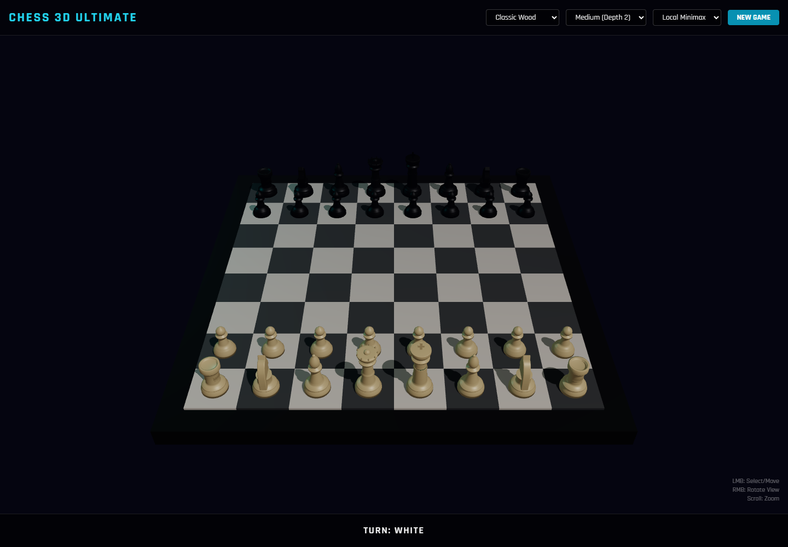

# Chess 3D Ultimate

Jeu d'echecs 3D dans le navigateur. Il combine plateau WebGL, pieces procedurales, regles chess.js, IA locale et option Gemini.

## Objectif

Creer un jeu d'echecs visuel, interactif et presentable.

## Fonctions principales

- Affiche un plateau d'echecs 3D interactif.
- Valide les coups et gere la partie avec chess.js.
- Joue les reponses IA en mode local ou Gemini.
- Propose plusieurs themes et effets visuels.

## Installation locale

```powershell
npm install
```

## Lancement

```powershell
npm run dev
npm run build
```

## Captures d'ecran




## Variables d'environnement

Aucune variable d'environnement n'a ete detectee par l'orchestrateur.

## Securite

Ne jamais publier `.env`, tokens, sessions, logs sensibles, cles privees ou donnees personnelles.
